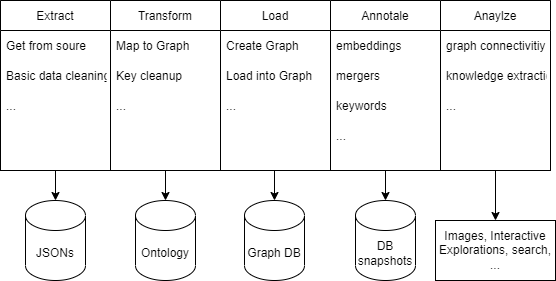

# ETLAA Model for graph management

## Concept

This model expands upon the standard ETL-system (Extract, Transform, Load) by our two Graph-related components: Annotate and Analyze.
The goal is to create a pipeline where end-users are able to hop in at every part of the pipeline and use the results to their own liking, e.g. only use the Graph DB without any further modification or use an annotated version which is specifically tailored to their application. This is enabled by the emission of specific *ressources* at every step in the pipeline. 