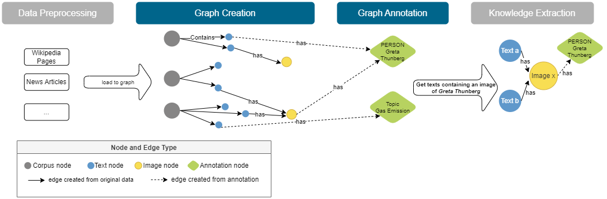

# Corpus Annotation Graph Builder (CAG)


* [Overview](#overview)
* [Installation](#installation)
* [Usage](#usage)


## Overview




**Corpus Annotation Graph builder (CAG)**  is an *architectural framework* that employs the *build-and-annotate* pattern for creating a graph. CAG is built on top of [ArangoDB](https://www.arangodb.com) and its Python drivers ([PyArango](https://pyarango.readthedocs.io/en/latest/)). The *build-and-annotate* pattern consists of two phases (see Figure above): (1) OOI data is collected from different sources (e.g., publication databases, online encyclopedias, news feeds, web portals, electronic libraries, repositories, media platforms) and preprocessed to build the core nodes. The component responsible for this phase is the **Graph-Creator**. (2) Annotations are extracted from the OOIs, and corresponding annotation nodes are created and linked to the core nodes. The component dealing with this phase is the **Graph-Annotator**.

This framework aims to offer researchers a flexible but unified and reproducible way of organizing and maintaining their interlinked document collections in a Corpus Annotation Graph. 

## Installation

### Direct install via pip 

The package can also be installed directly via pip.
```
pip install cag
```

This will allow you to use the module **`cag`** from any python script locally. The two main packages are **`cag.framework`** and **`cag.view_wrapper`**.


### Manual cloning
This package is in the early development stages - to use/update it, clone the repository, go to the root folder and then run:

```
pip install -e .
```
## Usage

* Graph Creation [[jupyter notebook](examples/1_create_graph.ipynb)]
* Graph Annotation [[jupyter notebook](examples/2_annotate_graph.ipynb)]

